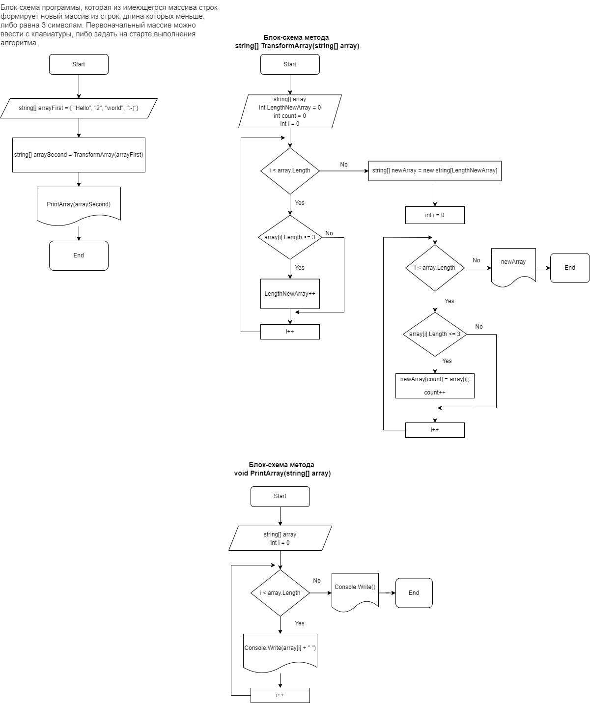

# Final_task_Choice_of_specialization_GB

##Описание проекта

Данная программа из имеющегося массива строк формирует новый массив из строк, длина которых меньше, либо равна 3 символам. Первоначальный массив задается на старте выполнения алгоритма

##Требования

Для работы Вам потребуется установить на свой рабочий компьютер: **Git, Visual Studio Code и .NET** 
Данные программы Вы можете скачать используя следующие ссылки:

* Git - [сайт c установочным файлом Git](https://git-scm.com/book/en/v2/Getting-Started-Installing-Git)

* VS Code - [сайт c установочным файлом Visual Studio Code](https://code.visualstudio.com)

* .NET > 6.0.0 - [сайт c установочным файлом .NET](https://dotnet.microsoft.com/en-us/download/dotnet/6.0)

##Блок-схема программы

